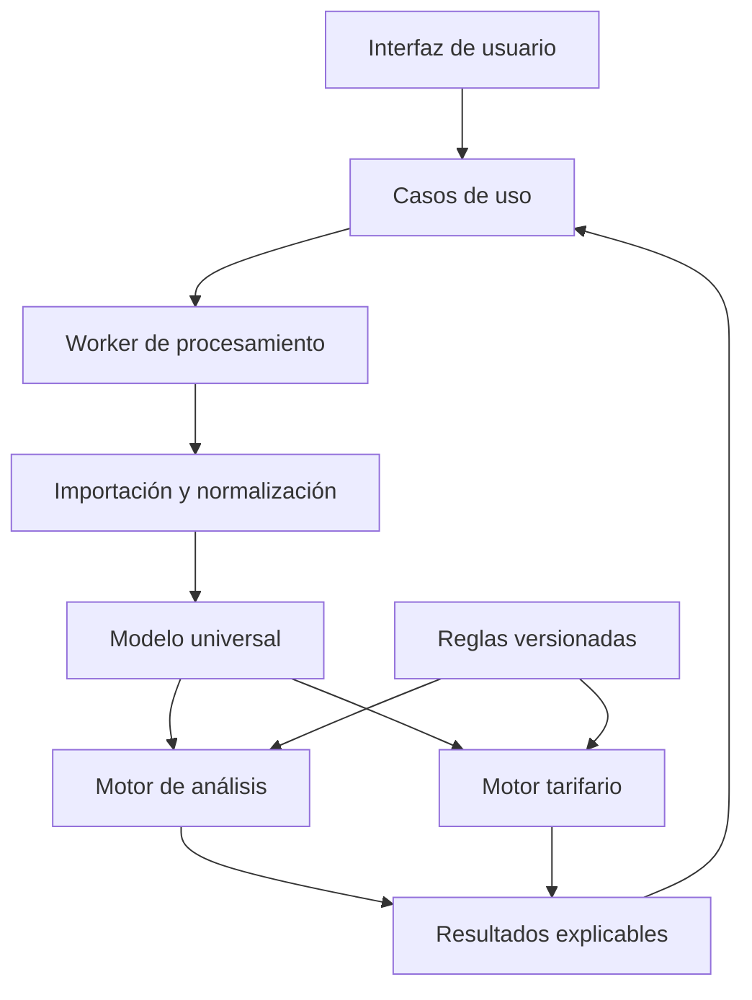

# FileSimulator — Arquitectura del proyecto

**Estado:** principios aprobados; plataforma técnica sustituida por `arquitectura-estatica-github-pages-v0.2.md`  
**Versión:** 0.1  
**Fecha:** 15 de julio de 2026  
**Alcance de este documento:** arquitectura y proceso de desarrollo; todavía no contiene código.

> Nota histórica: las decisiones React, TypeScript y Vite de este documento ya no están vigentes. El desarrollo real utiliza HTML, CSS y JavaScript sin compilación según la arquitectura estática v0.2.

## 1. Decisión principal

FileSimulator nacerá como una **aplicación web modular, local-first y sin backend en su primera versión**.

- Será una sola aplicación y un solo repositorio: el analizador de archivos y el simulador de tarifas no serán dos productos separados.
- Los archivos de clientes se leerán y procesarán dentro del navegador. Por defecto no se enviarán a ningún servidor ni se conservarán después de cerrar la sesión.
- La interfaz no contendrá fórmulas de negocio. Los cálculos vivirán en un núcleo de dominio independiente, probado y reutilizable.
- Un modelo universal de consumo alimentará tanto los gráficos como los distintos calculadores tarifarios.
- Las tarifas, calendarios y reglas con vigencia temporal estarán versionados. Un resultado siempre indicará qué versión de reglas utilizó.
- El proyecto será un **monolito modular**: una sola aplicación desplegable, dividida internamente en módulos con responsabilidades estrictas. Es la opción más mantenible para el alcance actual y evita la complejidad prematura de microservicios.

Esta decisión mantiene la privacidad y permite seguir publicando una aplicación estática. Si en el futuro se necesitan usuarios, historiales compartidos o una base central, se añadirá un adaptador de servidor sin reemplazar el motor de cálculo.

## 2. Alcance inicial

### Incluido

- Carga de archivos de consumo eléctrico con registros cada 15 minutos.
- Detección, validación y normalización del formato.
- Informe de calidad: filas inválidas, duplicados, huecos, intervalos inesperados y campos faltantes.
- Cálculo de consumo, potencia demandada, estadísticas y agregaciones por período.
- Clasificación configurable por Punta, Llano y Valle, incluyendo calendario, fines de semana y feriados cuando corresponda.
- Gráficos y tablas de análisis.
- Simulación mensual y anual de tarifas aplicables.
- Desglose explicable de cada cálculo, ranking y ahorro frente a la situación de referencia.
- Exportación de resultados en una etapa posterior del mismo alcance.

### Fuera del alcance actual

- Gestión de clientes y suministros.
- Inicio de sesión, roles y trabajo multiusuario.
- RAG, correos corporativos, IA local y automatizaciones.
- Almacenamiento central de archivos de clientes.
- Aplicaciones móviles nativas.

Estas capacidades podrán agregarse después, pero no condicionarán el diseño ni retrasarán la primera versión confiable.

## 3. Arquitectura general



### Capas y responsabilidades

1. **Presentación**
   - Pantallas, navegación, formularios, tablas y gráficos.
   - Muestra estados de carga, advertencias y resultados.
   - No interpreta tarifas ni realiza fórmulas eléctricas.

2. **Aplicación**
   - Coordina acciones completas: importar un archivo, analizarlo, simular una tarifa o comparar alternativas.
   - Traduce resultados del dominio a modelos de pantalla.
   - Define puertos para archivos, configuración, persistencia y exportación.

3. **Dominio**
   - Contiene las reglas puras de consumo, calendario, períodos de facturación, potencia, reactiva, impuestos, tarifas y comparación.
   - No depende de React, del navegador, de Excel ni de una base de datos.
   - Sus funciones reciben datos y devuelven resultados; no leen archivos ni modifican la interfaz.

4. **Infraestructura**
   - Adaptadores para leer XLSX/CSV u otros formatos confirmados.
   - Acceso opcional a IndexedDB, archivos de configuración y exportadores.
   - Es la única capa que conoce librerías externas de archivos o almacenamiento.

5. **Procesamiento en segundo plano**
   - La lectura, normalización, agregación y simulación se ejecutarán mediante un Web Worker.
   - La interfaz seguirá respondiendo mientras se procesan archivos extensos.
   - La comunicación se hará con mensajes tipados y serializables, con progreso, resultado o error explícito.

6. **Configuración versionada**
   - Catálogo de tarifas por vigencia.
   - Calendarios y feriados.
   - Esquemas de formatos de importación.
   - Reglas configurables que no deban estar incrustadas en la interfaz.

## 4. Modelo universal de datos

El archivo original nunca será el contrato interno de la aplicación. Primero se transformará a un formato canónico.

| Entidad conceptual | Responsabilidad |
| --- | --- |
| Archivo importado | Nombre, tamaño, hash de sesión, hoja, formato detectado y advertencias. |
| Registro de intervalo | Fecha-hora normalizada, duración, energía activa, reactiva disponible, origen de la fila y marcas de calidad. |
| Calendario clasificado | Día hábil/no hábil, feriado y franja horaria aplicable. |
| Período de facturación | Inicio, fin, estado completo/incompleto y registros incluidos. |
| Dataset de análisis | Intervalos válidos más agregaciones por día, mes, franja y período. |
| Definición tarifaria | Identidad, vigencia, requisitos, familia de cálculo, precios, impuestos y reglas de redondeo. |
| Entrada de simulación | Dataset, tarifa, potencia contratada/solicitada y demás datos exigidos por esa tarifa. |
| Resultado de factura | Total, conceptos, cantidades, precios, impuestos, redondeos, advertencias y versión de reglas. |
| Comparación | Resultados homogéneos por período, ahorro, ranking y motivos de exclusión o falta de datos. |

Principios del modelo:

- Conservar el valor original y la referencia de fila para poder explicar errores.
- Registrar unidades; nunca deducir silenciosamente si una columna representa kWh, kW o pulsos.
- La conversión de energía de intervalo a potencia se realizará únicamente después de validar la duración del intervalo.
- Marcar datos faltantes o dudosos; no inventar valores para completar una simulación.
- Separar fecha-hora, calendario y período de facturación. Son conceptos relacionados, pero no equivalentes.

## 5. Módulos principales

### Importación de archivos

- Selecciona o recibe el archivo arrastrado.
- Inspecciona hojas, encabezados y tipos de celdas.
- Selecciona un adaptador conocido o solicita un mapeo cuando el formato sea ambiguo.
- Produce datos crudos estructurados; todavía no calcula tarifas.

### Validación y normalización

- Valida columnas, unidades, fechas, duración esperada y valores numéricos.
- Detecta duplicados, huecos, orden incorrecto y cambios de intervalo.
- Genera el modelo universal y un informe de calidad.
- Bloquea solamente los errores que vuelven inseguro el cálculo; las advertencias no destructivas quedan visibles.

### Calendario y franjas horarias

- Clasifica cada intervalo según zona horaria, tipo de día, feriado y franja.
- Las franjas y calendarios se seleccionan por vigencia.
- Permite variantes horarias sin duplicar el resto del análisis.

### Períodos de facturación

- Agrupa por el ciclo que se defina: mes calendario, lectura a lectura u otro esquema validado.
- Identifica períodos parciales.
- Impide comparar como equivalentes períodos incompatibles sin advertirlo.

### Análisis de consumo y potencia

- Totales, promedios, máximos, mínimos, percentiles y distribución.
- Agregaciones por día, semana, período y franja.
- Curvas, perfiles típicos, heatmaps y detección de saltos cuando esa regla sea aprobada.
- Devuelve series preparadas; el módulo de gráficos solo las representa.

### Catálogo tarifario

- Contiene metadatos, vigencias, parámetros, requisitos y fuente de cada tarifa.
- Distingue reglas de elegibilidad de fórmulas de facturación.
- No permite editar silenciosamente una versión histórica: una actualización crea una versión nueva.

### Motor de facturación

- Usa familias de cálculo reutilizables: energía simple por escalones, doble horario, triple horario, cargos de potencia, reactiva e impuestos.
- Cada tarifa combina una familia con su configuración y, solo si hace falta, una regla especializada pequeña.
- Devuelve un desglose línea por línea y una traza legible del cálculo.
- Realiza importes con aritmética decimal y reglas explícitas de redondeo, no con decimales binarios comunes.

### Comparador de tarifas

- Verifica primero si cada tarifa es aplicable y si tiene todos los datos necesarios.
- Simula cada período con las mismas entradas base.
- Compara mes a mes y anual; calcula ahorro frente a la tarifa actual o escenario elegido.
- Una tarifa incompleta aparecerá como “no calculable” con el motivo, no con un resultado aproximado oculto.

### Presentación y reportes

- Dashboard, explorador de datos, simulación y comparación.
- Tablas y gráficos consumen resultados preparados por los casos de uso.
- Exportación futura de un informe con entradas, supuestos, versión tarifaria y desglose.

### Persistencia local

- Guarda únicamente preferencias, catálogos descargados o resultados si el usuario lo solicita.
- El archivo bruto y los datos identificables no se persistirán por defecto.
- IndexedDB no se considerará una copia de seguridad; las sesiones importantes deberán poder exportarse.

## 6. Comunicación entre módulos

Flujo de una sesión normal:

1. La interfaz envía el archivo al caso de uso **Importar archivo**.
2. El caso de uso ordena al worker inspeccionar y leerlo mediante un adaptador.
3. Validación devuelve un informe. Si el formato es ambiguo, la interfaz pide al usuario resolver el mapeo.
4. Normalización crea registros universales sin fórmulas tarifarias.
5. Los motores de calendario, períodos y análisis generan el dataset derivado.
6. La interfaz muestra el análisis y solicita los datos manuales que aún sean necesarios.
7. **Comparar tarifas** consulta el catálogo vigente, evalúa aplicabilidad y llama al motor de facturación para cada tarifa y período.
8. El resultado vuelve con desglose, advertencias, versión de reglas y ranking.
9. La interfaz representa el resultado o genera un reporte; nunca recalcula importes.

Reglas de comunicación:

- Dependencias dirigidas hacia el dominio; el dominio no importa módulos de interfaz o infraestructura.
- Contratos tipados entre capas.
- Sin variables globales compartidas.
- Sin bus de eventos general en la primera versión: llamadas explícitas y un protocolo pequeño con el worker son más fáciles de seguir y probar.
- Errores con categorías: archivo, calidad de datos, regla faltante, tarifa no aplicable y fallo técnico.

## 7. Estructura de carpetas propuesta

```text
filesimulator/
├── docs/
│   ├── architecture/          Decisiones y diagramas
│   ├── adr/                   Un registro por decisión importante
│   ├── business-rules/        Reglas validadas con UTE y su fuente
│   ├── test-cases/            Casos manuales y resultados esperados
│   └── samples/               Archivos pequeños y anonimizados
├── config/
│   ├── tariffs/               Tarifas separadas por año/vigencia
│   ├── calendars/             Feriados y calendarios aplicables
│   └── import-schemas/        Formatos de archivo reconocidos
├── public/                    Recursos estáticos públicos
├── src/
│   ├── app/                   Inicio, rutas, composición y proveedores
│   ├── pages/                 Pantallas de alto nivel
│   ├── features/
│   │   ├── file-import/       UI y flujo de importación
│   │   ├── data-quality/      Informe y resolución de problemas
│   │   ├── analysis/          Dashboard y exploración
│   │   ├── tariff-simulation/ Simulación individual
│   │   └── tariff-comparison/ Comparación y ahorro
│   ├── application/
│   │   ├── use-cases/         Orquestación de acciones completas
│   │   └── ports/             Contratos con archivos, storage y config
│   ├── domain/
│   │   ├── consumption/       Intervalos, unidades y agregaciones
│   │   ├── calendar/          Días, feriados y franjas
│   │   ├── billing-periods/   Ciclos de facturación
│   │   ├── tariffs/           Definiciones y elegibilidad
│   │   ├── billing/           Familias y conceptos de cálculo
│   │   └── comparison/        Ranking y ahorro
│   ├── infrastructure/
│   │   ├── file-parsers/      Adaptadores XLSX/CSV
│   │   ├── repositories/      Configuración y persistencia
│   │   └── exporters/         Exportaciones futuras
│   ├── workers/               Procesamiento en segundo plano
│   ├── shared/
│   │   ├── ui/                Sistema visual reutilizable
│   │   ├── charts/            Componentes de visualización
│   │   ├── validation/        Esquemas comunes
│   │   └── utils/             Utilidades sin reglas de negocio
│   └── assets/
├── tests/
│   ├── unit/                  Dominio y cálculos aislados
│   ├── integration/           Parser → modelo → simulación
│   ├── golden/                Facturas/casos con resultado confirmado
│   └── fixtures/              Datos de prueba anonimizados
├── e2e/                       Recorridos completos en navegador
├── scripts/                   Verificadores y tareas de mantenimiento
└── .github/workflows/         Calidad, pruebas y despliegue
```

No se crearán carpetas vacías por adelantado. Esta es la estructura objetivo; cada carpeta aparecerá cuando el primer cambio real la necesite.

## 8. Tecnologías propuestas

| Área | Tecnología | Motivo |
| --- | --- | --- |
| Lenguaje | TypeScript en modo estricto | Detecta incompatibilidades antes de ejecutar y documenta los contratos del dominio. |
| Interfaz | React | Componentes mantenibles para dashboards, formularios y estados complejos. |
| Construcción | Vite | Aplicación estática rápida, soporte directo para TypeScript, React y Workers; adecuada para GitHub Pages. |
| Navegación | React Router | Separa importación, análisis y comparación sin introducir un framework de servidor. |
| Estado de sesión | Zustand, limitado a estado de UI/aplicación | Estado pequeño y explícito; nunca contendrá las fórmulas del dominio. |
| Archivos | SheetJS Community Edition, versión fijada y evaluada | Lectura de XLSX/CSV en navegador. Se aislará detrás de adaptadores para poder sustituirla. |
| Validación | Zod | Valida en tiempo de ejecución archivos y configuraciones que TypeScript no puede garantizar por sí solo. |
| Fechas | date-fns con soporte de zona horaria | Operaciones explícitas y testeables usando `America/Montevideo`. |
| Dinero | decimal.js | Evita errores de coma flotante en precios, impuestos y redondeos. |
| Gráficos | Apache ECharts | Buen soporte para grandes series, zoom, heatmaps y reutilización de datasets. |
| Procesamiento | Web Workers | Evita bloquear la interfaz durante importaciones y simulaciones extensas. |
| Persistencia | IndexedDB mediante Dexie | Configuración y resultados opcionales dentro del navegador, sin servidor. |
| Pruebas unitarias | Vitest | Integración directa con Vite y ejecución rápida del motor puro. |
| Pruebas de componentes | Testing Library | Verifica comportamiento visible sin acoplarse a la implementación. |
| Pruebas completas | Playwright | Recorre carga, análisis y comparación en navegadores reales. |
| Calidad | ESLint, Prettier y TypeScript check | Reglas automáticas antes de integrar un cambio. |
| CI/CD | GitHub Actions + GitHub Pages | Compila, prueba y publica solamente versiones aceptadas. |
| Instalación local futura | PWA después de estabilizar el núcleo | Permitirá abrirla como aplicación y usar recursos cacheados sin agregar un backend. |

### Tecnologías que no se recomiendan ahora

- **Next.js:** aporta servidor, renderizado y convenciones que FileSimulator no necesita para su primera versión estática y local.
- **FastAPI/Node como backend:** no hay todavía una necesidad que justifique enviar o centralizar datos de clientes.
- **PostgreSQL u otra base remota:** sería complejidad y riesgo de privacidad sin un caso de uso actual.
- **Microservicios:** dificultarían pruebas, despliegue y mantenimiento para un producto que hoy puede vivir correctamente en una sola aplicación.

## 9. Estrategia para tarifas

El motor no tendrá una función enorme con todas las tarifas mezcladas.

1. Cada tarifa tendrá identidad, nombre, vigencia, fuente, requisitos y familia de cálculo.
2. Las familias resolverán patrones repetidos: cargo fijo, energía por escalones, energía por franjas, potencia, reactiva e impuestos.
3. Los precios y parámetros estarán separados de los algoritmos.
4. Una excepción real de una tarifa se implementará como una regla pequeña y específica, con pruebas propias.
5. Cada tarifa se incorporará de a una, con casos confirmados antes de pasar a la siguiente.
6. La comparación solo utilizará versiones tarifarias compatibles con el período simulado.
7. Todo resultado mostrará cantidades, precios, subtotales, impuestos, redondeo, total y advertencias.

Este diseño permite actualizar los precios anuales sin reescribir la aplicación y reduce el riesgo de que corregir una tarifa rompa otra.

## 10. Calidad, versiones y forma de trabajo

### Ramas y estabilidad

- `main`: versión estable y publicada.
- `dev`: integración validada antes de pasar a producción.
- `feature/...` y `fix/...`: cambios pequeños y de corta duración.
- Versiones etiquetadas para cada entrega estable.

### Condiciones para integrar un cambio

- Alcance pequeño y explicado antes de implementarlo.
- Criterio de aceptación escrito.
- Pruebas nuevas o actualizadas.
- Formato, tipos, pruebas y compilación correctos.
- Verificación manual cuando afecte interfaz o archivos reales.
- Ninguna modificación tarifaria sin fuente, vigencia y caso esperado.

### Pirámide de pruebas

- Muchas pruebas unitarias sobre fórmulas y clasificación horaria.
- Pruebas de integración con archivos pequeños anonimizados.
- Casos “golden” comparados contra facturas o cálculos validados manualmente.
- Pocas pruebas end-to-end para los recorridos críticos.

## 11. Riesgos y mitigaciones

| Riesgo | Impacto | Mitigación |
| --- | --- | --- |
| Reglas tarifarias ambiguas o incompletas | Resultado económico incorrecto | Documentar cada regla, vigencia, fuente y caso esperado antes de programarla. |
| Archivos con formatos variables | Importaciones rotas o datos mal interpretados | Adaptadores por formato, detección conservadora, mapeo asistido e informe de calidad. |
| Confusión entre energía y potencia | Máximas y cargos incorrectos | Unidades obligatorias, duración validada y conversiones centralizadas. |
| Fechas, feriados o límites de intervalo | Clasificación en franja equivocada | Zona horaria explícita, reglas de borde y casos de prueba para medianoche/cambio de período. |
| Redondeos e IVA | Diferencias acumuladas respecto a factura | Aritmética decimal y orden de redondeo documentado por concepto. |
| Datos faltantes para una tarifa | Ranking engañoso | Estado “no calculable” con motivo; nunca completar silenciosamente. |
| Archivos grandes en navegador | Lentitud o falta de memoria | Worker, límites visibles, agregación progresiva y reducción de puntos solo para visualización. |
| Dependencia de una librería XLSX | Fallos o riesgo de cadena de suministro | Adaptador aislado, versión fijada, revisión de licencia/origen y fixtures de regresión. |
| Configuración anual desactualizada | Simulaciones con precios equivocados | Catálogos inmutables por vigencia y fecha/version visible en resultados. |
| Publicación accidental de datos reales | Riesgo de privacidad | Solo muestras anonimizadas en el repositorio; sin telemetría ni subida de archivos. |
| Cambio grande que rompe la estable | Interrupción del uso | Ramas cortas, CI obligatoria, `main` protegida y releases recuperables. |
| IndexedDB borrado por el navegador | Pérdida de sesiones guardadas | No tratarlo como backup y permitir exportar resultados/configuración. |

## 12. Roadmap por etapas

Cada etapa termina con una versión utilizable y verificable. No se empieza la siguiente hasta cumplir su criterio de salida.

### Etapa 0 — Contratos y reglas

- Aprobar esta arquitectura.
- Inventariar formatos de archivo y obtener muestras anonimizadas.
- Definir unidades, significado del timestamp, intervalos y política de errores.
- Inventariar tarifas y fuentes vigentes.
- Crear los primeros casos de cálculo manual confirmado.

**Salida:** contratos de entrada y reglas críticas firmadas; ninguna fórmula pendiente se trata como supuesta.

### Etapa 1 — Base técnica y sistema visual

- Crear el proyecto mínimo, navegación, estilo base y automatización de calidad.
- Configurar `main`, `dev`, CI y publicación controlada.
- Crear el esqueleto únicamente de los módulos necesarios.

**Salida:** aplicación vacía pero estable, accesible, compilable y probada.

### Etapa 2 — Primera importación vertical

- Soportar un único formato real confirmado.
- Mostrar hoja, columnas detectadas, rango temporal y errores.
- Normalizar registros sin calcular aún tarifas.

**Salida:** el mismo archivo produce siempre el mismo dataset universal validado.

### Etapa 3 — Motor de análisis base

- Consumo, potencia y estadísticas esenciales.
- Agregación por día y período.
- Informe de calidad completo.

**Salida:** resultados contrastados con una planilla de referencia y pruebas automatizadas.

### Etapa 4 — Calendario, períodos y franjas

- Motor de períodos de facturación.
- Punta/Llano/Valle configurables.
- Fines de semana, feriados y reglas de borde.

**Salida:** totales por franja confirmados en casos con días hábiles, fin de semana y feriado.

### Etapa 5 — Dashboard y gráficos

- Resumen ejecutivo, curva, filtros y tablas.
- Gráficos con agregación adecuada al rango visible.
- Estados vacíos, advertencias y accesibilidad.

**Salida:** análisis completo y fluido con archivos de tamaño real.

### Etapa 6 — Fundaciones del motor tarifario

- Catálogo versionado, familias de cálculo, aritmética decimal y desglose.
- Implementar una sola tarifa piloto de extremo a extremo.
- Crear casos golden.

**Salida:** la tarifa piloto coincide con los cálculos validados y explica cada concepto.

### Etapa 7 — Tarifas una por una

- Incorporar cada tarifa en un cambio independiente.
- Para cada una: requisitos, elegibilidad, fórmula, casos normales y casos límite.
- No mezclar varias tarifas nuevas en una misma entrega.

**Salida:** catálogo objetivo completo, con cobertura y evidencia por tarifa.

### Etapa 8 — Comparación mensual y anual

- Selección de tarifas aplicables.
- Comparación por período, total anual, ranking y ahorro.
- Manejo explícito de tarifas no calculables y datos faltantes.

**Salida:** comparación reproducible y auditada contra escenarios manuales.

### Etapa 9 — Persistencia, exportación y uso offline

- Preferencias y sesiones opcionales.
- Exportación de informe y datos derivados.
- PWA y cache de la aplicación, después de validar actualización segura.

**Salida:** herramienta instalable, recuperable y usable sin conexión para sesiones locales.

### Etapa 10 — Endurecimiento y versión 1.0

- Piloto con archivos variados y usuarios reales del equipo.
- Rendimiento, accesibilidad, seguridad y mensajes de error.
- Manual de actualización anual de tarifas.
- Congelar una versión estable y etiquetada.

**Salida:** FileSimulator 1.0 apto para uso interno habitual.

## 13. Decisiones pendientes antes de programar negocio

Estas preguntas son “puertas de decisión”. La arquitectura no necesita asumir sus respuestas, pero el código de dominio sí.

### Archivo y medición

- Formatos exactos que entrarán en la versión 1: XLSX, XLS, CSV, JSON u otros.
- Nombre y significado de cada columna/magnitud: AE, Q1 y futuras.
- Si el timestamp representa inicio o fin del intervalo.
- Unidad exacta de cada valor y tratamiento de ceros, negativos y correcciones.
- Qué hacer con duplicados, huecos, 95/97 registros por cambio horario y períodos incompletos.

### Período y calendario

- Ciclo de facturación: mes calendario, día 3 a día 2 u otra regla por suministro.
- Horarios definitivos y si dependen de tarifa, fecha o elección del usuario.
- Tratamiento exacto de sábados, domingos y feriados.
- Fuente oficial y mecanismo de actualización de feriados.

### Potencia y reactiva

- Definición de potencia demandada usada por cada tarifa.
- Potencia contratada, solicitada y medida: cuáles son entradas y cuáles se derivan.
- Magnitudes reactivas disponibles y fórmulas aplicables por grupo/tensión.

### Tarifas y factura

- Lista exacta de tarifas que formarán la primera versión.
- Pliego/fuente, vigencia y tensión de cada una.
- Reglas de aplicabilidad y datos obligatorios.
- Orden de cálculo, IVA, bonificaciones/recargos y redondeo por concepto o por factura.
- Qué total se usará como referencia para el ahorro.

### Experiencia y operación

- Navegadores y computadoras objetivo.
- Tamaño máximo realista de archivo y cantidad máxima de meses.
- Si se permitirá guardar sesiones localmente.
- Formatos de reporte prioritarios.

## 14. ADR iniciales

- **ADR-001:** una sola aplicación y repositorio para análisis y tarifas.
- **ADR-002:** monolito modular; sin microservicios.
- **ADR-003:** procesamiento local por defecto; sin backend inicial.
- **ADR-004:** dominio puro e independiente de React y Excel.
- **ADR-005:** modelo universal antes de cualquier cálculo tarifario.
- **ADR-006:** tarifas y calendarios versionados por vigencia.
- **ADR-007:** resultados explicables y aritmética decimal.
- **ADR-008:** `main` siempre estable; cambios pequeños con pruebas y CI.

## 15. Referencias técnicas oficiales

- React, creación de una aplicación desde cero: https://react.dev/learn/build-a-react-app-from-scratch
- Vite, guía y despliegue estático: https://vite.dev/guide/ y https://vite.dev/guide/static-deploy
- TypeScript, comprobación estática: https://www.typescriptlang.org/docs/handbook/2/basic-types.html
- Web Workers: https://developer.mozilla.org/en-US/docs/Web/API/Web_Workers_API
- SheetJS CE: https://docs.sheetjs.com/docs/
- Zod: https://zod.dev/
- Apache ECharts, datasets: https://echarts.apache.org/handbook/en/concepts/dataset/
- Dexie/IndexedDB: https://dexie.org/docs
- Vitest: https://vitest.dev/guide/
- Playwright: https://playwright.dev/
- GitHub Pages y Actions: https://docs.github.com/en/pages/getting-started-with-github-pages/configuring-a-publishing-source-for-your-github-pages-site
